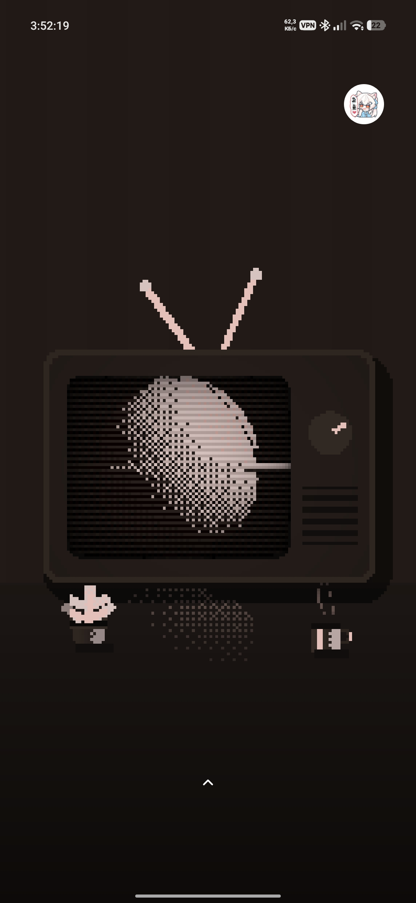

# 80s Retro Room

Обои в пиксельном ретро стиле

Телевизор с возможностью взаимодействия с ним (переключение каналов, дергания антенн)

**Большая часть компонентов обоев - GLSL шейдеры**

**Поэтому для нормальной работы обоев рекомендуется отключить "Программную отрисовку"**

Все цвета обоев адаптируются под вашу Monet

---

## Энергосбережение

Комплект обоев не помечен как энергоэффективный (`isLite = false`)

---

## Превью



---

## Требования

Wallify 1.0.0 (11)

Отключенная программная отрисовка!

Не зависит от гироскопа

---

## Автор

rich_beluga

My Telegram: [@rich_beluga](https://t.me/rich_beluga)

My GitHub: [rich-beluga](https://github.com/rich-beluga)

meow :3

```text
      |\      _,,,---,,_
ZZZzz /, `.-'`'    -.  ;-;;,_
     |,4-  ) )-,_. ,` (  `'-'
    '---''(_/--'  `-'\_)
```